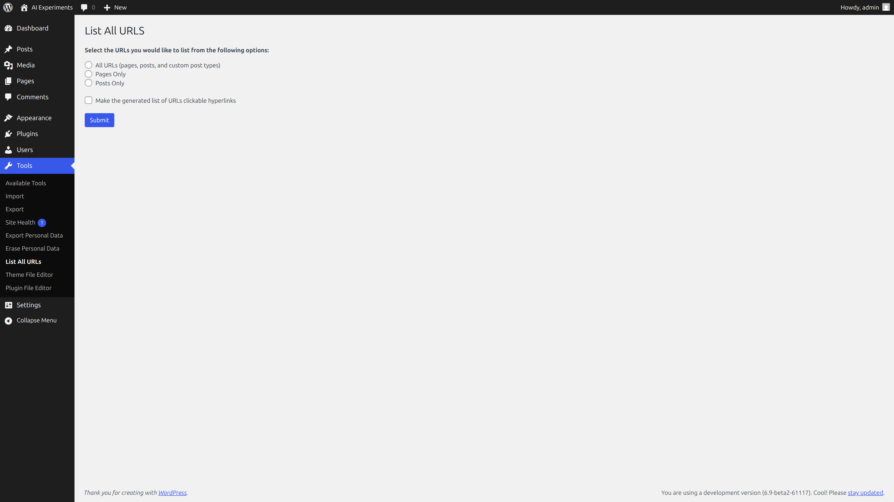
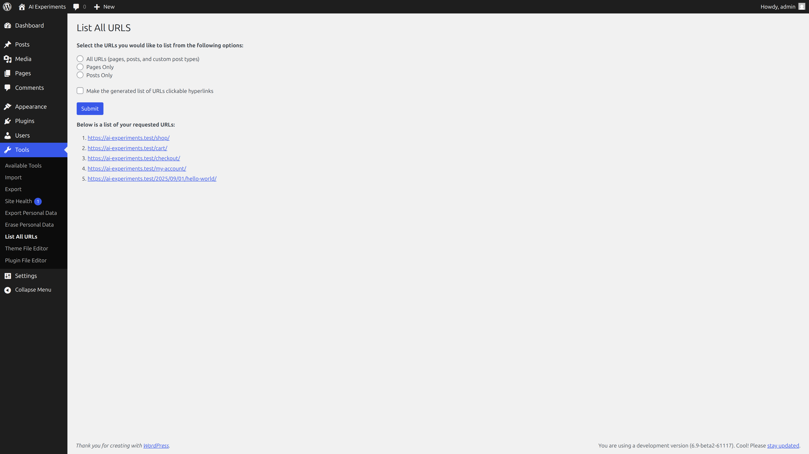

# Introducing the WordPress Abilities API: A developer's guide

Since the official announcement of the [WordPress AI team](https://wordpress.org/news/2025/05/announcing-the-formation-of-the-wordpress-ai-team/), I’ve been keeping a close eye on the work the team has been doing. One of those projects, slated for inclusion in WordPress 6.9, is the brand new [Abilities API](https://github.com/WordPress/abilities-api).

This API is designed to bring a unified, discoverable, and secure approach to how WordPress core, plugins, and themes define and expose their capabilities — or "abilities." The Abilities API is part of [WordPress's AI Building Blocks](https://make.wordpress.org/ai/2025/07/17/ai-building-blocks/) initiative, aiming to unlock new possibilities for automation, AI integration, and smoother developer workflows.

## What is the WordPress Abilities API?

The Abilities API provides a central registry where WordPress capabilities (or abilities) are registered in a format that’s both machine-readable and human-friendly. This means that abilities are not only discoverable by developers but also accessible programmatically by automation tools across different platforms, including AI agents.

The key goals of this project are:

- **Discoverability:** List and inspect all available abilities through a standard interface.
- **Interoperability:** A Uniform schema enables unrelated components to compose workflows.
- **Security-first:** Explicit permission control on who or what can invoke abilities.
- **Gradual Adoption:** Starting as a Composer package plugin with plans to smoothly migrate to WordPress core.

Think of it as a one-stop shop for what WordPress or any plugin/theme can do, registered in a way everyone (and everything) can understand.

Now, I don’t know about you, but I find it easier to understand how something works when I can see it in action. To do that, I’m going to implement Abilities in a plugin I maintain, List All URLs.

> [!NOTE]
> You can find a full copy of the plugin code in [this GitHub repository](https://github.com/wptrainingteam/list-all-urls).

## List All URLs

The plugin itself is minimalist. It registers a Tools sub-menu item that opens an admin page where you can select to list the URLs of all Posts, Pages, or Custom Post Types on your WordPress site.





There is one primary function that powers the fetching and display of the data, the `list_all_urls_generate_url_list()` [function](https://github.com/wptrainingteam/list-all-urls/blob/c61ef4a4ea36acf279a8a2ff9038737db1bdbd25/list-all-urls.php#L49). This function receives two arguments and generates the list of URLs to display on the page.

```
/**
* Generate a list of URLs based on the provided arguments
* Optionally make them clickable links
*
* @param array $arguments Arguments to customize the URL generation.
* @param bool  $makelinks Whether to return clickable links or plain URLs (escaped).
*
* @return array List of generated URLs.
*/
function list_all_urls_generate_url_list( array $arguments = array(), bool $makelinks = false ): array {
   $default_args   = array(
           'post_type'      => 'post',
           'posts_per_page' => - 1,
           'post_status'    => 'publish',
   );
   $args           = wp_parse_args( $arguments, $default_args );
   $posts          = get_posts( $args );

   $links = array();
   foreach ( $posts as $post ) {
      $permalink = get_permalink( $post );
      if ( $makelinks ) {
         $links[] = '<a href="' . esc_url( $permalink ) . '">' . esc_html( $permalink ) . '</a>';
      } else {
         $links[] = esc_html( $permalink );
      }
   }

   return $links;
}

```

Internally, this function calls the WordPress `get_posts()` function to retrieve the actual data, and then formats the data based on whether it should be displayed as a list of clickable links or not.

There are a couple of smaller quality-of-life improvements I’d like to add, such as an option to limit results for sites with a large number of URLs, the ability to filter URLs by categories or date ranges, and an option to export the returned URLs.

However, two of the larger features I want to add are:

1. A way to access the URL list outside of WordPress (ie, a REST API endpoint) to be able to hook the data into external services.
2. A block that would allow anyone to add the list of URLs to any implementation of the Block Editor (ie, on any post or page, or even in a template).

To do this, I’d need to set up a few things.

> [!NOTE]
> For those who prefer browsing the code for this solution, you can see the full implementation in action by checking out the `rest-blocks` [branch](https://github.com/wptrainingteam/list-all-urls/tree/rest-blocks) of the GitHub repository.

I’ll need to register a custom REST API route and associated GET endpoint using `register_rest_route()`, which should get the posts for the route.

That would need a callback function to fetch the data, which in turn could call `list_all_urls_generate_url_list` without the `$makelinks` parameter to return the data.
```
add_action( 'rest_api_init', 'list_all_urls_register_rest_route' );
function list_all_urls_register_rest_route (): void {
   register_rest_route(
           'list-all-urls/v1',
           '/urls',
           array(
               'methods' => 'GET',
               'callback' => 'list_all_urls_rest_fetch_all_urls',
               'args' => array(
                       'type' => array(
                               'validate_callback' => function( $param ) {
                                   return is_string( $param );
                               }
                       ),
               ),
           )
   );
}

function list_all_urls_rest_fetch_all_urls( $arguments ){
   if ( isset($arguments['type'] ) ) {
       $post_type = sanitize_text_field( wp_unslash( $arguments['type'] ) );
   } else {
       $post_type = 'any';
   }
   $args = array(
       'post_type'      => $post_type,
   );
   return list_all_urls_generate_url_list( $args );
}
```

For the custom block I would scaffold the block structure using [create-block](https://developer.wordpress.org/block-editor/reference-guides/packages/packages-create-block/), and then make use of the custom REST API endpoint and the [api-fetch](https://developer.wordpress.org/block-editor/reference-guides/packages/packages-api-fetch/) package to fetch the data for the block’s `Edit` component and render it in the Editor.

```
export default function Edit() {
    const [urls, setUrls] = useState([]);

    useEffect(() => {
        apiFetch( { path: '/list-all-urls/v1/urls' } ).then( ( urls ) => {
            setUrls( urls );
        } );
    }, []);

    if ( ! urls ) {
        return (
            <div { ...useBlockProps() }>
                <p>{ __(
                    'Loading...',
                    'list-all-urls'
                ) }</p>
            </div>
        );
    }

    let urlsList = urls.map( ( url ) => {
        return <li><a href={ url }>{ url }</a></li>;
    });

    return (
        <div { ...useBlockProps() }>
            <ul>{ urlsList }</ul>
        </div>
    );
}
```

I’d probably make it a dynamic block that calls the `list_all_urls_generate_url_list` function in a `render.php` file which is configured to render on the front end.

```
<?php
/**
* Render file for the List All URLs block.
*/
$block_attributes = get_block_wrapper_attributes();
$urls = list_all_urls_generate_url_list( array( 'post_type' => 'any' ), true );
$urlList = '';
foreach ( $urls as $url ) {
   $urlList .= '<li>' .  wp_kses_post( $url ) . '</li>';
}
?>
<div <?php echo $block_attributes; ?>>
   <ul>
       <?php echo $urlList; ?>
   </ul>
</div>
```

I'd probably want to update the block to support the various attributes for post type selection, and whether to make links clickable or not, but before I got to that there's a significant amount of foundational work required, just to make the core plugin functionality possible across three different places. It’d be really nice if I could wrangle most of that just by registering it all in one place.

This is the perfect problem that registering a custom Ability would solve.

## Installing the Abilities API

To get started, I want to ensure I’m working with the latest version of the API.

Currently, there are three ways you can install and test the Abilities API:

- You can clone the [GitHub repository](https://github.com/WordPress/abilities-api/) into your `wp-content/plugins` directory, install any dependencies, run the build steps, and activate the plugin.
- You can download the latest version from the [releases](https://github.com/WordPress/abilities-api/releases) page of the GitHub repository, and then upload and install the plugin zip file.
- You can require the [**Composer package**](https://packagist.org/packages/wordpress/abilities-api) as a dependency of your plugin or theme.

My preferred method for testing the Abilities API is to clone the GitHub repository, as this ensures I have the latest version of the code on the `trunk` branch.

```
git clone git@github.com:WordPress/abilities-api.git
cd abilities-api
composer install
npm install
npm run build 
```

However, when I’m building Abilities into plugins, I prefer to install the composer package, which is what I’ll do to integrate it into List All URLs

```
cd /wp-content/plugins/list-all-urls
composer require wordpress/abilities-api
```

## Abilities to the rescue

In this case, a custom Ability can handle most, if not all, of the required core functionality. The [PHP docs](https://github.com/WordPress/abilities-api/blob/trunk/docs/php-api.md) contain everything you need on how to register and use Abilities in PHP, but let's take a look at what I need for List All URLs.

> [!NOTE]
> As before, if you prefer to browse the full code for this implementation, you can check out the `abilities` [branch](https://github.com/wptrainingteam/list-all-urls/tree/abilities) of the GitHub repository.

First, I need to register an Ability category. This allows me to group my abilities in a single taxonomy. To do that, I use the `wp_abilities_api_categories_init` action hook, and the `wp_register_ability_category()` function in the hook callback to register the category.

```
add_action( 'wp_abilities_api_categories_init', 'list_all_urls_register_ability_categories' );
/**
 * Register the ability category for the plugin
 *
 * @return void
 */
function list_all_urls_register_ability_categories() {
    wp_register_ability_category( 'list-all-urls', array(
            'label' => __( 'List all URLs', 'list-all-urls' ),
            'description' => __( 'Abilities from the List all URLs plugin.', 'list-all-urls' ),
    ));
}
```

Now I can register the Ability, using the `wp_abilities_api_init` action hook, and the `wp_register_ability()` function.

```
add_action( 'wp_abilities_api_init', 'list_all_urls_register_abilities' );
/**
 * Register the ability to list all URLs
 *
 * @return void
 */
function list_all_urls_register_abilities() {
    wp_register_ability(
        'list-all-urls/urls',
        array(
            'label' => __( 'Get All URLs', 'list-all-urls' ),
            'description' => __( 'Retrieves a list of URLs from the WordPress site, optionally as clickable anchor links.', 'list-all-urls' ),
            'category' => 'list-all-urls',
            'input_schema' => array(
                'type' => 'object',
                'properties' => array(
                        'post_type' => array(
                                'type' => 'string',
                                'description' => 'The post type to retrieve URLs from (e.g., post, page, custom post type).',
                            ),
                        'posts_per_page' => array(
                                'type' => 'integer',
                                'description' => 'Number of posts to retrieve. Use -1 to retrieve all posts.',
                        ),
                        'post_status' => array(
                                'type' => 'string',
                                'description' => 'The status of the posts to retrieve (e.g., publish, draft).',
                        ),
                        'makelinks' => array(
                                'type' => 'boolean',
                                'description' => 'Whether to return URLs as clickable anchor links.',
                        ),
                ),
            ),
            'output_schema' => array(
                    'type' => 'object',
                    'properties' => array(
                            'url' => array(
                                    'type' => 'string',
                                    'description' => 'URL or clickable link to the URL'
                            )
                    )
            ),
            'execute_callback' => 'list_all_urls_generate_url_list',
            'permission_callback' => '__return_true',
        )
    );
}
```

## Diving into Ability registration

Registering an Ability requires a unique identifier (`list-all-urls/urls`) and an array of arguments. Most of the arguments are optional, but the required ones are:
- `label`: A human-readable name for the Ability.
- `description`: A brief description of what the Ability does.
- `category`: The category under which the Ability is grouped.
- `output_schema`: The schema that defines the structure of the data returned by the Ability.
- `execute_callback`: The function that will be called when the Ability is executed.
- `permission_callback`: A function that determines whether the current user has permission to execute the Ability.

The `input_schema` argument is optional, but highly recommended if your Ability requires input parameters. In my case I'd want to be able to pass in the same arguments that `list_all_urls_generate_url_list()` accepts.

Setting these schema’s not only lets the Ability know what data it can expect and return, but also allows for automatic validation of that data. For example if I tried passing a `posts_per_page` value in the input that didn’t evaluate to an integer, it would automatically cause a validation error, and stop the Ability from executing.

You’ll notice that I’m using the original `list_all_urls_generate_url_list()` function as the Ability `execute_callback`, so nothing has to change there.

### Getting and using an ability in PHP

The next step is to update the internal admin page to fetch and execute the ability.

All that really needs to change here is setting up the `$input` array, fetching the ability, and executing it.

```
$input = array(
    'post_type'      => $post_type,
    'posts_per_page' => - 1,
    'post_status'    => 'publish',
    'makelinks'      => $makelinks,
);

$urlsAbility = wp_get_ability( 'list-all-urls/urls' );
$urls = $urlsAbility->execute( $input );
```

Now, what I really like about this implementation is how extendable this is. If I wanted to allow other plugin or theme developers to make use of this functionality, all I have to do is document the ability id, the input schema, and the output schema.

Not only that, but during development, you could fetch the `list-all-urls/urls` ability through something like WP CLI’s `wp shell` command. The input and output schema are included in the returned ability object, so it’s essentially self-documenting.

```
$ability = wp_get_ability( 'list-all-urls/urls' );

WP_Ability Object
(
   [name:protected] => list-all-urls/urls
   [label:protected] => Get All URLs
   [description:protected] => Retrieves a list of URLs from the WordPress site, optionally as clickable anchor links.
   [category:protected] => list-all-urls
   [input_schema:protected] => Array
       (
           [type] => object
           [properties] => Array
               (
                   [post_type] => Array
                       (
                           [type] => string
                           [description] => The post type to retrieve URLs from (e.g., post, page, custom post type).
                       )

                   [posts_per_page] => Array
                       (
                           [type] => integer
                           [description] => Number of posts to retrieve. Use -1 to retrieve all posts.
                       )

                   [post_status] => Array
                       (
                           [type] => string
                           [description] => The status of the posts to retrieve (e.g., publish, draft).
                       )

                   [makelinks] => Array
                       (
                           [type] => boolean
                           [description] => Whether to return URLs as clickable anchor links.
                       )

               )

       )

   [output_schema:protected] => Array
       (
           [type] => object
           [properties] => Array
               (
                   [url] => Array
                       (
                           [type] => string
                           [description] => URL or clickable link to the URL
                       )

               )

       )

   [execute_callback:protected] => list_all_urls_generate_url_list
   [permission_callback:protected] => __return_true
   [meta:protected] => Array
       (
           [annotations] => Array
               (
                   [readonly] =>
                   [destructive] =>
                   [idempotent] =>
               )
       )

)

```

### REST API support out of the box

The other really cool thing about Abilities is that you can enable their REST API endpoints in a similar way as when creating a Custom Post Type. By simply enabling the `meta.show_in_rest` argument, your custom Abilities will support the [Abilities REST API endpoints](https://github.com/WordPress/abilities-api/blob/trunk/docs/rest-api.md).

```
'meta' => array(
       'show_in_rest' => true,
),
```

The [Abilities REST API endpoints](https://github.com/WordPress/abilities-api/blob/trunk/docs/rest-api.md) are available under the `wp-json/wp-abilities/v1` namespace. Access to the Abilities REST API endpoints requires an authenticated user, which supports all the same authentication methods as the WordPress REST API. You can perform a series of default Ability actions using this namespace including:

- listing all Abilities by sending a *GET* request to `/wp-json/wp-abilities/v1/abilities`
- retrieving a single Ability by sending a *GET* request to `wp-json//wp-abilities/v1/{namespace/ability}`, where `{namespace/ability}` is the unique ID of your registered Ability (eg `list-all-urls/urls`)
- executing an Ability by sending either a *GET* or *POST*  request (depending on the Ability's `readonly` setting) to `/wp-json/wp-abilities/v1/{namespace/ability}/run`.

What's more, the `permission_callback` set during Ability registration is also respected when executing Abilities via the REST API. This ensures that only authenticated users with the correct permissions can execute any given Ability via the REST API.

All that, just by enabling a single argument on registration!

## Abilities are coming to Core!

The server-side Abilities registration, retrieval and execution, including REST API support was recently [approved to be merged in WordPress 6.9](https://core.trac.wordpress.org/ticket/64098). This means that once [6.9 is released in early December](https://make.wordpress.org/core/6-9/), you’ll have access to all this functionality out of the box in WordPress. You can even help test it right now by following the instructions in the [Help Test WordPress 6.9](https://make.wordpress.org/test/2025/10/21/help-test-wordpress-6-9/) post.

## Using an ability in JavaScript

Now, you might be thinking, “Ok, but I still have to use something like the `fetch-api` to fetch the data from the REST API endpoints?” Well, dear reader, that’s the fun part. 

The Abilities API also includes a [JavaScript client](https://github.com/WordPress/abilities-api/blob/trunk/docs/javascript-client.md), with built-in support for fetching and executing your custom Abilities in the browser.

For now, the JavaScript client is only available via the GitHub repository; however, the goal is to eventually ship it as a Gutenberg package. As a result, there’s a good chance it will be included in WordPress core by version 7.0 (or possibly earlier via the Gutenberg plugin).

For now, though, if you require the Abilities API as a composer package, you can start using it in your plugins or themes, without causing any conflicts with the Core Abilities API.

The JavaScript client ships with functions to fetch and execute custom Abilities, and even a function to create custom Abilities in JavaScript. In the case of List all URLs I only need the function to execute my Ability.

```
import { executeAbility } from '@wordpress/abilities';
```

And then I can execute the Ability, passing it a JSON object for the required input, and use the data it returns in my block.

```
useEffect(() => {
   executeAbility( 'list-all-urls/urls', { 'makelinks': attributes.makeLinks } ).then( ( urls ) => {
       setUrls( urls );
   } );
}, []);

```

## Where to learn more and get involved

- Follow the development of the Abilities API in the official [GitHub repository](https://github.com/WordPress/abilities-api) and make sure to [read the docs](https://github.com/WordPress/abilities-api/tree/trunk/docs).
- Join discussions on the WordPress Slack [#core-ai channel](https://wordpress.slack.com/archives/C08TJ8BPULS/p1747960962509329) or follow the [Core AI team blog](https://make.wordpress.org/ai/) for updates and news.

## We’re just scratching the surface of the possibilities.

My colleague [Em Shreve](https://href.li/?http://profiles.wordpress.org/emdashcodes/) (who was instrumental in building out the Abilities API JavaScript client) describes the Abilities API like this:

> A first-class, cross-context functional API that other tools and applications can use to interface with WordPress.

And that’s exactly what it is. It’s very much “batteries included”, which is something that not only makes my life as a developer easier, but it makes it easier for other developers and users to extend what I build. 

What I really like about Abilities is what is made possible just by registering a single Ability. I can use it anywhere else in my own plugin. Other plugin and theme developers can use its functionality in their products using the same Core API functions. Enabling a single argument makes it possible to access and execute any Ability through external tools and automation services via the REST API. The bundled JavaScript client enables retrieval and execution almost everywhere else, from the Block editor to headless WordPress setups. Not only that, but if you combine Abilities with something like the [WordPress MCP adapter](https://github.com/WordPress/mcp-adapter), you can even allow any AI agents to automatically interact with your Abilities, unlocking even more possibilities. (Now that's a blog post for another day!)

The Abilities API is an exciting new way to develop with WordPress, and I can’t wait to see what it enables for the future of WordPress.