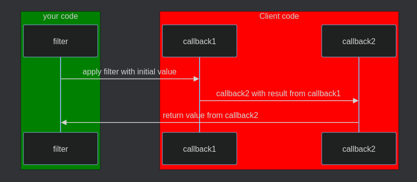
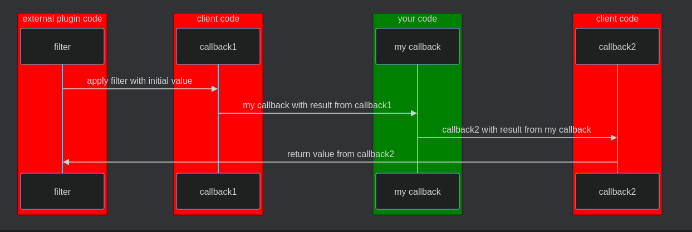

<!-- Original script by Cyrille C: https://github.com/CrochetFeve0251 -->

# Good practices

While WordPress hooks are quite easy to begin with, it is however harder to master them.

## Naming hooks

The first point comes with naming hooks.

### Actions

As an action involves a change of state, I would advise you to use a verb within its name.

```php
do_action('delete_post');
```

Then if the action is happening before the actual event the convention is to prefix it with `pre_`.

```php
do_action('pre_delete_post');
```

Finally, if the action is after the actual event, it is advised to use a past tense inside the name.

```php
do_action('deleted_post');
```

### Filters

On the other side, a filter is a value and due to that it is advised to use nouns within its name.

```php
apply_filters('sitemap_url', 'https://example.org/sitemap.xml');
```

## Handling the filter type mess

When using a filter, the type from the value is never guaranteed even it is set in the docblock.

### The problem
There is a simple reason for that: It is the last callback that decides what is returned by the filter, and that also means the last callback decides the type from the value.

That might not seem an issue at first, but you need to remember when you are creating your custom hooks that you are not the one who will be writing the callbacks but your users.



This means that you have no control on what your users will return and if a wrong type is returned, it might make your plugin crash.

### The solution

The solution for this comes in two parts:

#### Validating your filter output

The best way to make sure the output value is the type we expect is to validate it.

For primitive types as integer, float or boolean, we can cast the output value as following:
- `boolean`: `$value = (bool) apply_filters('my_filter', true);`
- `integer`: `$value = (int) apply_filters('my_filter', 10);`
- `float`: `$value = (float) apply_filters('my_filter', 10.0);`

However, for more complex validation or other types, it is better to have a manual validation.
For example, for a string or an array,
it would be better to check if the returned value is the right type
rather than casting which could lead to a fatal error.

For a string that would give the following:
```php
$initial = 'my_value';

$value = apply_filters('my_filter', $initial);

if ( ! is_string( $value ) ) {
    $value = $initial;
}
```

#### Assert your callbacks value

However, that incertitude on the type of the value inside filters does not only apply to their output, but it is also present on each callback.



This is why it is important to never strongly type the value from a filter (the first parameter).

The same way it is also important to always make a check on the type from the value before performing any operation on it.

```php
function my_callback($value) {
    if(! is_string($value)) {
        return $value;
    }
    
    return $value . "my_string";
}
```

## Getting information on a hook

Another good thing to know about hooks is how to get information about them.

### Determining the current hook

WordPress allows a callback function or method to be used on different events.

Due to that, it can be sometimes unclear on which hook the callback is actually running.

This is why WordPress introduced two functions.

#### current_filter

If you are in a callback linked with filters,
it is possible to use the function [`current_filter`](https://developer.wordpress.org/reference/functions/current_filter/):

```php
function my_callback($value) {
    
    if('the_content_feed' === current_filter()) {
        return '';
    }
    
    return $value;
}

add_filter('the_content_rss', 'my_callback');
add_filter('the_content_feed', 'my_callback');

```

#### current_action

If you are in a callback linked with filters,
it is possible to use the function [`current_action`](https://developer.wordpress.org/reference/functions/current_action/):

```php
function my_callback() {
    
    if('init' === current_action()) {
        return;
    }
    
    // my logic
}

add_filter('amin_init', 'my_callback');
add_filter('init', 'my_callback');

```
### Check how many times a hook as run

Sometimes it is important to know if a callback has already run to prevent it from running again.

For that, it is possible to use two functions depending on if you want to check an action or a filter.

#### did_filter

If you want to know how many times a filter has been fired,
you can use the [`did_filter`](https://developer.wordpress.org/reference/functions/did_filter/) function:

```php
function my_callback($value) {
    
    if(0 < did_filter('pre_delete_attachment')) {
        return $value;
    }
    
    // My logic
    
    return $value;
}

add_filter('after_delete_post', 'my_callback');
```

#### did_action

If you want to know how many times ana action has been fired,
you can use the [`did_action`](https://developer.wordpress.org/reference/functions/did_action/) function:

```php
function my_callback() {
    
    if(0 == did_action('amin_init')) {
        return;
    }
    
    return ;
    
    // my logic
}

add_action('added_option', 'my_callback');
```
