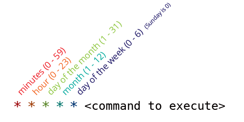

# Hooking WP Cron into the System Task Scheduler

As mentioned previous event, if using native WP Cron is easier as it works out of the box, it is not the best option you have for critical tasks.

For this reason, it is important to use the System Task Scheduler of your operating system to make sure jobs are executed on time.

## Enable the System Task Scheduler

Depending on your operating system, you will have a different configuration.

### Windows
Windows calls their time based scheduling system the Task Scheduler. It can be accessed via the Administrative Tools in the control panel.

How you setup the task varies with server setup. One method is to use PowerShell and a Basic Task. After creating a Basic Task the following command can be used to call the WordPress Cron script.

```
powershell "Invoke-WebRequest http://YOUR_SITE_URL/wp-cron.php"
```

### MacOS and Linux

Mac OS X and Linux both use cron as their time based scheduling system. It is typically access from the terminal with the crontab -e command. It should be noted that tasks will be run as a regular user or as root depending on the system user running the command.

Cron has a specific syntax that needs to be followed and contains the following parts:

Minute

Hour

Day of month

Month

Day of week

Command to execute



If a command should be run regardless of one of the time sections an asterisk (*) should be used. For example if you wanted to run a command every 15 minutes regardless of the hour, day, or month it would look like:

```
*/15 * * * * command
```
Many servers have wget installed and this is an easy tool to call the WordPress Cron script.

```
wget --delete-after http://YOUR_SITE_URL/wp-cron.php
```

## Disable the vanilla WP-Cron

Once the system task scheduler is active on our website, it is now time to remove the existing mechanism from WordPress.

For that we need to go into the website `wp-config.php` file and add the following constant:

```php
define('DISABLE_WP_CRON', true);
```

Once this is done, we are now relying on the system task scheduler to run our WordPress website.

